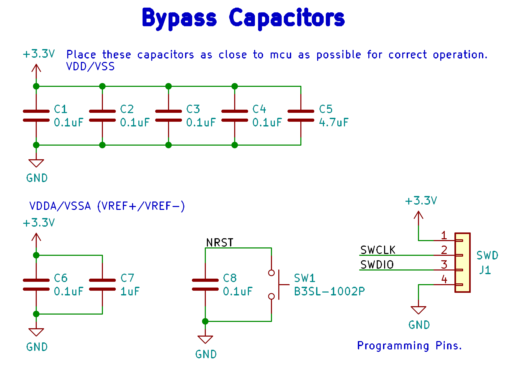
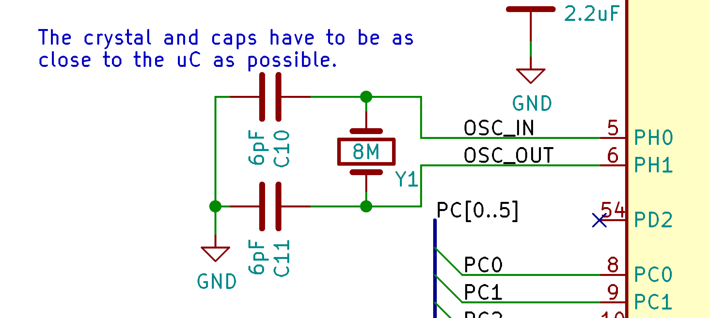
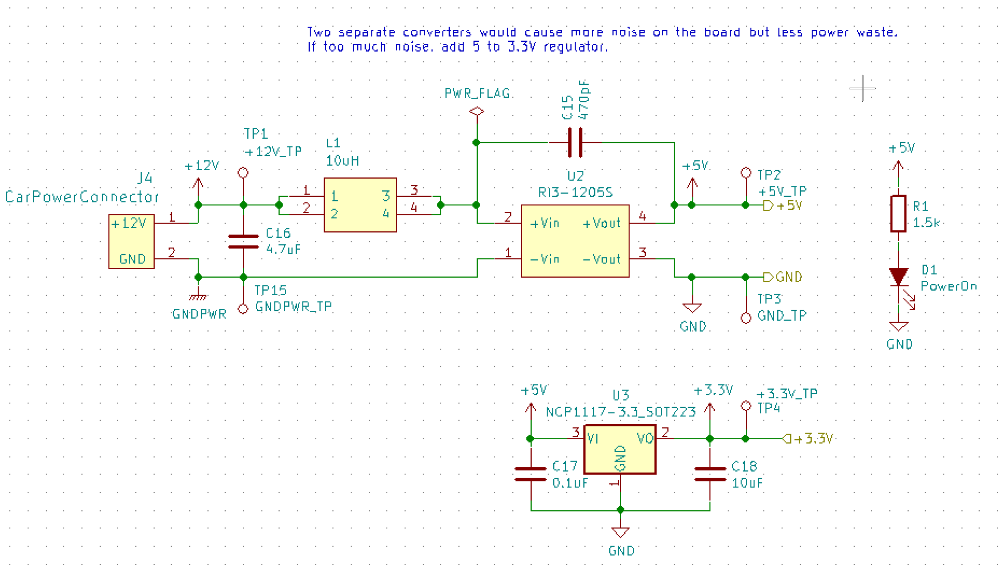
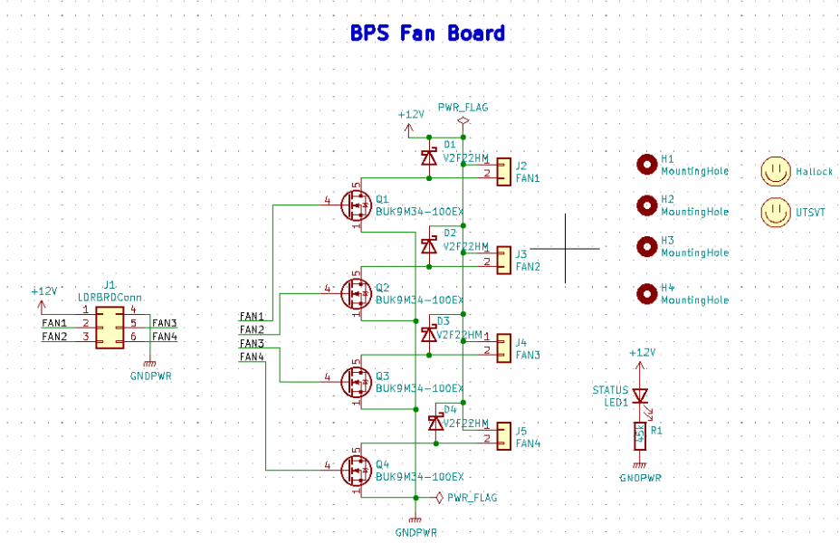
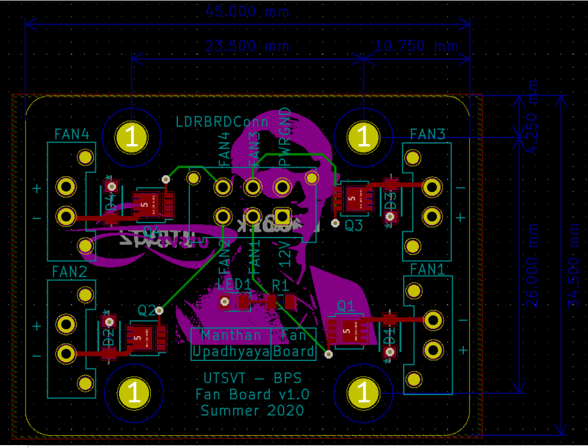
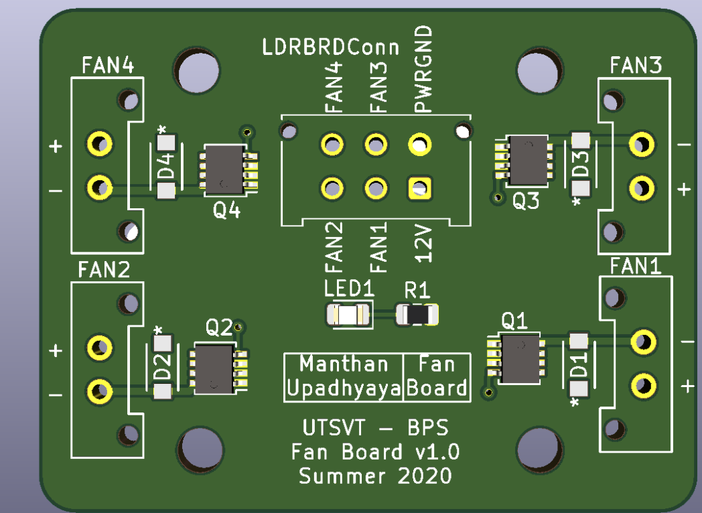

********
Boards
********

There are two temperature sensors for each battery module with a module minion board for each of the four rows.
Each board measures up to 12 battery modules and 16 temperature sensors, but is configured for eight modules and 
16 sensors by default.

The Amperes minion board is connected to the main power cable that powers the electrical loop using the :term:`Shunt Resistor`. 

Leader board
============

The Leader board uses the STM32F413 microcontroller. The board requires seven connectors:

* One 2-pin :ref:`power connector <power-connector>` (+12V, PWRGND)
* One 2-pin error light connector (+12V, PWRGND)
* One 4-pin contactor connector (+12V, PWRGND, aux1, aux2)
* One 4-pin Amperes board connector (+12V, PWRGND, IP, IM)
* One 4-pin CAN connector (isolated +5V, isolated GND, CAN high, CAN low)
* One 2-pin Minion connector (IP, IM)
* One 2x4-pin fan connector (4x +12V, 4x PWRGND)

The STM32F413 requires bypass capacitors and uses an 8MHz clock. To program the STM32F413, pins are connected to a 1x4 header to use the :abbr:`SWD (Serial Wire Debug)` programming protocol. 

The reset button allows you to avoid powering the BPS off to reset it.

.. note::
    You can configure the system to reset every time you use the Keil IDE to program it. 

For more information, see the `STM32F413 datasheet <https://www.st.com/resource/en/reference_manual/dm00305666-stm32f413-423-advanced-arm-based-32-bit-mcus-stmicroelectronics.pdf>`__.

    STM32F413 bypass capacitors 

The system's :abbr:`RTC (Real Time Clock)` is sourced from a low-power crystal oscillator. The crystal is used to set the :abbr:`PLL (Phase Lock Loop)`, which 
sets the system core frequency (CPU clock speed). The controller supports a range of frequencies, but the default is 8MHz. 

The :abbr:`MCU (Microcontroller Unit)` has an alternate internal clock that saves power consumption at the cost of precision. 
Since this system is safety critical, the external 8MHz crystal was added. 

.. note::
    The internal and external clocks were not tested against each other.

Capacitor values are set based on the crystal’s load capacitance and the capacitance of the whole board. 
The crystal and capacitor should be as physically close to the MCU as possible to avoid signal drift.

    STM32 crystal layout

.. _power-connector:

Power connector
^^^^^^^^^^^^^^^
The Leader board gets a 12V power supply. The voltage must be dropped to power the MCU and components. The total voltage required for all the components is +3.3V and +5V. 

An isolated DC-DC converter (RI3-1205S) converts the +12V input to +5V. The +12V input will be isolated from the +5V output. The Leader board
must use the correct grounds to maintain isolation. 

A switching regulator (NCP1117) converts the +5V input to +3.3V. This does not need isolation because the +5V input and corresponding grounds are already isolated from the +12V line.

    Leader board power distribution

Fan Board
=========

Overview
^^^^^^^^
`GitHub Link <https://github.com/lhr-solar/BPS-FanPCB>`__

`BOM Link <https://www.mouser.com/ProjectManager/ProjectDetail.aspx?AccessID=272bad62cd>`__ 

Brief Description/Purpose:
    The purpose of this board is to set the speed of the fans that will be used to cool the battery 
    pack. It receives signals from the Leader Board and sends them across a MOSFET that switches 
    the fan on or off. 

Pertinent Regulations
^^^^^^^^^^^^^^^^^^^^^
========== ============================================== ===============================================
Regulation Description of Regulation                      How Regulation is Met

**8.4.D**  | Battery enclosures may be equipped with a    | The BPS fan board is powered by the battery 
           | forced ventilation system. Such ventilation  | system and in the event of a battery protection 
           | systems must pull exhaust to the exterior of | fault it's powered by the supplemental battery.
           | the solar car and must be directly connected 
           | to the exterior of the vehicle away from any 
           | airstream that may reach the driver. The 
           | ventilation system shall be powered by the 
           | battery system. In the event of a Battery 
           | Protection Fault, provisions should be made 
           | to power this fan from the Supplemental 
           | battery.
========== ============================================== ===============================================

Context
^^^^^^^
**Location of the Board:** With the BPS in the battery box 

List of I/O and Connections: 
    [List of all the inputs and outputs from this board and where it is connected to. 
    List all power signals first]
    
    * Power +12 V 
        * Input from BPS Leader Board 
    * Power GNDPWR 
        * Input from BPS Leader Board 
    * FAN 1 
        * :term:`PWM <Pulse Width Modulation>` Input from BPS Leader Board 
    * FAN 2 
        * :term:`PWM <Pulse Width Modulation>` Input from BPS Leader Board 
    * FAN 3 
        * :term:`PWM <Pulse Width Modulation>` Input from BPS Leader Board 
    * Fan 4 
        * :term:`PWM <Pulse Width Modulation>` Input from BPS Leader Board 

Schematic
^^^^^^^^^
*What does this circuit do?*
    They control the fan's speed for cooling the battery pack. 
*Why do we need it?*
    This board makes sure the batteries don’t heat up by controlling the speed of the fans based on
    the temperature. 
*List of Circuit Components*
    * Connector_Molex:Molex_Micro-Fit_3.0_43045-0612_2x03_P3.00mm_Vertical (LDRBRDConn) 
        * Description: connects the leader board to fan board 
        * Why is it necessary: so the fans can be supplied power 
        * Justification for selection of specific part: this connector provides the right amount 
          of power and connections for all fans being used 
        * Associated passives/components:  
            * 4 different BUK9M34-100EX 
    * BUK9M34-100EX(4) 
        * Description: a :term:`MOSFET <MOSFET>` that will switch the fans off and on 
        * Why is it necessary: so the fans can be set to certain speeds by turning them on and off at varying rates
        * Justification for selection of specific part: this part is used over others because of 
          Q101 compliant, its suitable for thermally demanding environments, and true logic gate 
          with VGS(th) rating of greather than 0.5V at 175°C 
        * `Datasheet <https://assets.nexperia.com/documents/data-sheet/BUK9M34-100E.pdf>`__ 
        * Associated passives/components:  
            * 4 different diodes, Molex_MicroFit3.0_1x2xP3.00mm_PolarizingPeg_Vertical and the 
              LDRBDConn above. 

*List of Subsheet I/O*

* Power +12 V 
    * Input from BPS Leader Board 
* Power GNDPWR 
    * Input from BPS Leader Board 
* FAN 1 
    * :term:`PWM <Pulse Width Modulation>` Input from BPS Leader Board 
* FAN 2 
    * :term:`PWM <Pulse Width Modulation>` Input from BPS Leader Board 
* FAN 3 
    * :term:`PWM <Pulse Width Modulation>` Input from BPS Leader Board 
* Fan 4 
    * :term:`PWM <Pulse Width Modulation>` Input from BPS Leader Board 

    Fan Board Schematic

**Dimensions: 45.00mm by 34.50mm**

Requirements/Constraints:  
    We chose :term:`MOSFET <MOSFET>` body diodes to be used as the transistor to prevent voltage spikes from entering 
    into the master board (since the fan speeds can change and that could cause the spikes).
    

    Fan Board Layout

    Fan Board Render
