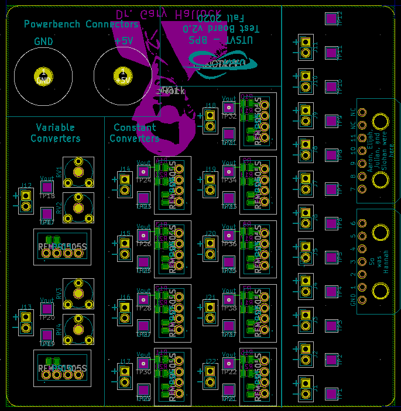
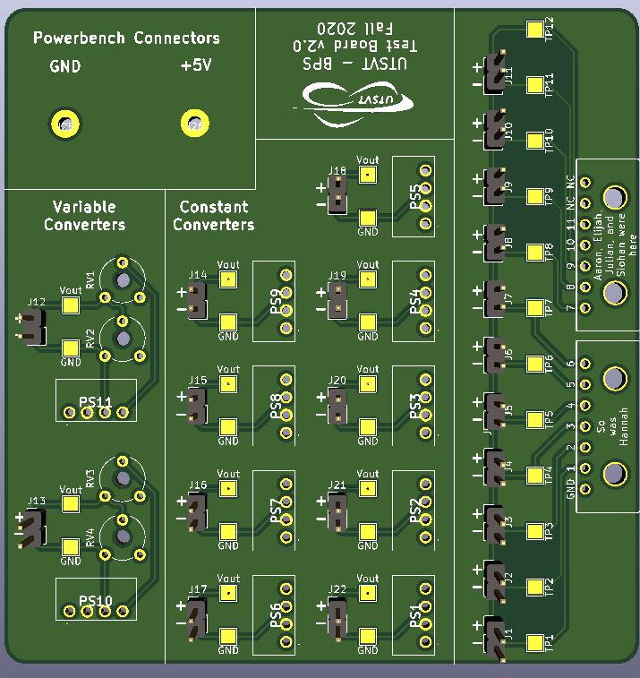

********
Boards
********

Amperes Minion Board
=====================

The Amperes minion board is connected to the main power cable that powers the electrical loop using 
the :term:`Shunt Resistor`. 

    AS8510 Block Diagram 

Overview
^^^^^^^^
`GitHub Link <https://github.com/lhr-solar/BPS-AmperesPCB/tree/master>`__

`BOM Link <https://www.mouser.com/ProjectManager/ProjectDetail.aspx?AccessID=b63ac43741>`__ 

Brief Description/Purpose:
   This board monitors the current and temperature of the BPS system.  

Pertinent Regulations
^^^^^^^^^^^^^^^^^^^^^
=========== ============================================== =================================================
Regulation  Description of Regulation                      How Regulation is Met

**8.3**     | All batteries must have protection circuitry | This board monitors the current/temperature 
            | appropriate for the battery technology used. | of the battery and sends both measurements 
            | Proof is required at scrutineering that the  | back to the BPS Leader. Then, the BPS system
            | protection System is functional and meet     | determines if these measurements are within 
            | manufacturer's specifications... All         | normal range and if not, will take 
            | protection circuitry should be contained in  | apropriate action.
            | the battery enclosure per Reg 8.4. 

**8.3.A.5** | System in which measurements are constantly  | This board sends current and temperature    
            | monitored and where actions are taken        | measurement back to the BPS leader 
            | immediately without operator intervention    | periodically. This helps the BPS Leader board 
            | to open the Main Power Switch should a       | determine when a Battery protection Fault 
            | battery Protection Fault occur. Any          | occurs and take appropriate actions.
            | manual clearing process is required by the   
            | driver with the vehicle not in motion and    
            | only after faults have been verified clear   
            | by the protection system.        
=========== ============================================== =================================================

Context
^^^^^^^
**Location of the Board:** Battery Box 

**List of I/O and Connections:**
    
    * Power +12 V 
        * Input from BPS Leader Board 
    * Power GNDPWR 
        * Input from BPS Leader Board 
    * Signal ETS  (External Temperature Sensor)
        * Input from Shunt Resistor Board 
    * Signal RSHL (Negative Differential input for current channel)
        * Input from Shunt Resistor Board 
    * Signal RSHH (Positive Differential input for current channel)  
        * Input from Shunt Resistor Board  
    * Signal TX+/TX-  
        * Output to BPS Leader Board  

Schematic
^^^^^^^^^

**Main**
++++++++

*What does this circuit do?*
    Monitors current and temperature of the BPS system. 
*Why do we need it?*
    This board physically measures the temperature and 
    current from the Shunt Resistor Board and then, sends the measurements back to the BPS Leader Board.  
*List of Circuit Components*
    * LTC2315  
        * Description: Shunt-based sensing/processing IC
        * Why is it necessary: Measures input current and temperature and sends it to the LTC6820 using SPI. 
        * Justification for selection of specific part:This device has higher accuracy for a
          larger range, compared to other products. 
        * `Datasheet <https://www.analog.com/media/en/technical-documentation/data-sheets/231512fa.pdf>`__ 
        * Associated passives/components:  
            * J1 Shunt Conn (1x4 Connector)  
    * RO-123.3S_HP 
        * Description: DC Converter  
        * Why is it necessary:  Converts +12V input into +3.3V, GNDPWR input to GND while maintaining the isolation of the input power.
        * Justification for selection of specific part: Standard component  
        * `Datasheet <https://www.mouser.com/datasheet/2/468/RO-1711124.pdf>`__ 
    * LTC6820 
        * Description: isoSPI Communications Interface   
        * Why is it necessary: Converts 4-wire SPI signal output from AS8510 into 2-wire isoSPI signal
        * Justification for selection of specific part: Standard component  
        * `Datasheet <https://www.analog.com/media/en/technical-documentation/data-sheets/LTC6820.pdf>`__   
    * HX1188FNL  
        * Description: Signal Transformer    
        * Why is it necessary: Isolates the isoSPI signal to be sent to the BPS Leader Board 
        * Justification for selection of specific part: Standard component  
        * `Datasheet <https://www.mouser.com/datasheet/2/336/H329-1199189.pdf>`__   
        * Associated passives/components:  
            * J2 Leader Conn (1x4 Connector)  

    Amperes Minion Board Schematic

**Dimensions: 58.250mm by 30.250mm**

Requirements/Constraints:  
    * The HX1188FNL needs to be isolated, as in it cannot be placed on a GND or Power layer. 
      So a keep-out area was used around the HX1188FNL.    
    * Connectors must be placed on opposite sides of the board. This will allow all the connections to fit on the board.   

Design Choices:    
    * The board was kept at a small size to conserve space  
    
.. figure:: ../_static/AmperesBrdLayout.png
    :align: center

    Amperes Minion Board Layout

    Amperes Minion Board Render

    Amperes Minion Board Render

Fan Board
=========

Overview
^^^^^^^^
`GitHub Link <https://github.com/lhr-solar/BPS-FanPCB>`__

`BOM Link <https://www.mouser.com/ProjectManager/ProjectDetail.aspx?AccessID=272bad62cd>`__ 

Brief Description/Purpose:
    The purpose of this board is to set the speed of the fans that will be used to cool the battery 
    pack. It receives signals from the Leader Board and sends them across a :term:`MOSFET <MOSFET>` that switches 
    the fan on or off. 

Pertinent Regulations
^^^^^^^^^^^^^^^^^^^^^
========== ============================================== ===============================================
Regulation Description of Regulation                      How Regulation is Met

**8.4.D**  | Battery enclosures may be equipped with a    | The BPS fan board is powered by the battery 
           | forced ventilation system. Such ventilation  | system and in the event of a battery protection 
           | systems must pull exhaust to the exterior of | fault it's powered by the supplemental battery.
           | the solar car and must be directly connected 
           | to the exterior of the vehicle away from any 
           | airstream that may reach the driver. The 
           | ventilation system shall be powered by the 
           | battery system. In the event of a Battery 
           | Protection Fault, provisions should be made 
           | to power this fan from the Supplemental 
           | battery.
========== ============================================== ===============================================

Context
^^^^^^^
**Location of the Board:** With the BPS in the battery box 

**List of I/O and Connections:**
    
    * Power +12 V 
        * Input from BPS Leader Board 
    * Power GNDPWR 
        * Input from BPS Leader Board 
    * FAN 1 
        * :term:`PWM <Pulse Width Modulation>` Input from BPS Leader Board 
    * FAN 2 
        * :term:`PWM <Pulse Width Modulation>` Input from BPS Leader Board 
    * FAN 3 
        * :term:`PWM <Pulse Width Modulation>` Input from BPS Leader Board 
    * Fan 4 
        * :term:`PWM <Pulse Width Modulation>` Input from BPS Leader Board 

Schematic
^^^^^^^^^

**Main**
++++++++

*What does this circuit do?*
    They control the fan's speed for cooling the battery pack. 
*Why do we need it?*
    This board makes sure the batteries don’t heat up by controlling the speed of the fans based on
    the temperature. 
*List of Circuit Components*
    * Connector_Molex:Molex_Micro-Fit_3.0_43045-0612_2x03_P3.00mm_Vertical (LDRBRDConn) 
        * Description: connects the leader board to fan board 
        * Why is it necessary: so the fans can be supplied power 
        * Justification for selection of specific part: this connector provides the right amount 
          of power and connections for all fans being used 
        * Associated passives/components:  
            * 4 different BUK9M34-100EX 
    * BUK9M34-100EX(4) 
        * Description: a :term:`MOSFET <MOSFET>` that will switch the fans off and on 
        * Why is it necessary: so the fans can be set to certain speeds by turning them on and off at varying rates
        * Justification for selection of specific part: this part is used over others because of 
          Q101 compliant, its suitable for thermally demanding environments, and true logic gate 
          with VGS(th) rating of greather than 0.5V at 175°C 
        * `Datasheet <https://assets.nexperia.com/documents/data-sheet/BUK9M34-100E.pdf>`__ 
        * Associated passives/components:  
            * 4 different diodes, Molex_MicroFit3.0_1x2xP3.00mm_PolarizingPeg_Vertical and the 
              LDRBDConn above. 

    Fan Board Schematic

**Dimensions: 45.00mm by 34.50mm**

Requirements/Constraints:  
    * We chose flyback diodes to be used to prevent voltage spikes from entering into the leader 
      board (since the pulsing fans can cause the spikes).
    
.. figure:: ../_static/FanBrdLayout.png
    :align: center

    Fan Board Layout

.. figure:: ../_static/FanBrdRender.png
    :align: center

    Fan Board Render

Display Board
=============

Overview
^^^^^^^^
`GitHub Link <https://github.com/lhr-solar/BPS-DisplayPCB>`__

`BOM Link <https://www.mouser.com/ProjectManager/ProjectDetail.aspx?State=EDIT&ProjectGUID=11b675c5-b15b-46bd-a790-bb450819a4d3>`__ 

Brief Description/Purpose:
    The purpose of this board is to display messages from the :term:`CAN <CAN Bus>` interface on 
    the E-Ink display for debugging.

Pertinent Regulations
^^^^^^^^^^^^^^^^^^^^^
========== ============================================== ===============================================
Regulation Description of Regulation                      How Regulation is Met

8.3.B.2    | All supplemental batteries must have at a    The "SUPP CHECK" (Supplemental Check) LED
           | minimum Passive Protection for under voltage 
           | where charging occurs remote to the solar 
           | vehicle unless they are primary cells. 
           | Active Protection is required if charging is 
           | within the solar vehicle. No Secondary 
           | Lithium battery types shall be used for the 
           | Supplemental Battery unless the Supplemental 
           | Battery is powering a commercially procured 
           | component such as a cell phone or laptop and 
           | the Supplemental Battery was intended for 
           | this purpose.
========== ============================================== ===============================================

Context
^^^^^^^
**Location of the Board:** On a movable arm mount attached to the south end of the board. Mounted near the driver.  

List of I/O and Connections: 
    
    * Power GNDPWR 
        * Input from car power connector 
    * Power +12V 
        * Input from car power connector 
    * Power +5V 
        * Output from power distribution subsheet 
    * Power +3.3V 
        * Output from power distribution subsheet 

Schematic
^^^^^^^^^

**Main**
++++++++

*What does this circuit do?*
    This circuit makes connections from the microcontroller to the E-Ink Display and logic 
    analyzer pins.  
*Why do we need it?*
    We need this circuit in order for debugging (:term:`CAN <CAN Bus>` messages on the E-Ink 
    display and logic analyzer pins).  
*List of Circuit Components*
    * STM32F413RHTx 
        * Description: Microcontroller 
        * Justification for selection of specific part: Standard component  
        * `Datasheet link <https://www.google.com/url?sa=t&rct=j&q=&esrc=s&source=web&cd=&cad=rja&uact=8&ved=2ahUKEwiqg4WM6NXuAhXULc0KHcHbAzIQFjABegQIAhAC&url=https%3A%2F%2Fwww.st.com%2Fresource%2Fen%2Fdatasheet%2Fstm32f413rg.pdf&usg=AOvVaw3U9MV6EuhEcmJpsEYCrU52>`__
        * Associated passives/components:
            * Bypass capacitors 
            * 8 MHz External Crystal Oscillator: used to set the Phase Lock Loop (PLL) and the system core frequency (CPU processor speed) 
                * Using an external clock ensures for precision, which is important in a safety-critical system like the BPS.  
            * Reset button
            * :term:`SWD <SWD>` Programming Pins
    * Logic Analyzer Pins (2.54 mm headers) 
        * **Description:** The logic analyzer pins serve to easily test the board to check proper 
          functionality of the board.  
        * **Why is it necessary:** This allows for testing to be much easier since we can monitor.
          what occurs to these signal lines through these pins  
        * Justification for selection of specific part: Standard component 
        * Associated passives/components:  
            * SPIO Analyzer Pins 1x5: PA5, PA6, PA7, PA8, GND 
            * GEN Analyzer Pins 1x4: PA9, PA10, PA11, GND 
            * USART Analyzer Pins 1x3: PC6, PC7, GND 
            * CAN Analyzer Pins 1x3: PB12, PB13, GND 
    * E-Ink Display: 
        * **Description:** Display screen. 
        * **Why is it necessary:** CAN messages will be displayed on this screen.  
        * Justification for selection of specific part: This display doesn't consume much power. 
        * Associated passives/components: 
            * 2x20 Connector 
    * 2x20 Connector (2.54mm) 
        * **Description:** Connects the STM to the E-Ink display. 
        * **Why is it necessary:** Allows the E-Ink display to show CAN messages. 
        * Justification for selection of specific part: Standard component 
        * Associated passives/components: 
            * Buttons: PB0, PB1, PB2, PB3 
            * SPIO: PA5, PA6, PA7, PA8 
            * GEN: PA9, PA10, PA11 
    * Reset button 
        * **Description:** Resets the STM microcontroller. 
        * **Why is it necessary:** Used in case the board needs to be reset. 
        * Justification for selection of specific part: Standard component 

*List of Subsheet I/O*

* Power +5V: 
    * Input from power distribution subsheet 
* Power +3.3V: 
    * Input from power distribution subsheet 
* CAN TX: 
    * Input from CAN subsheet 
* CAN RX: 
    * Input from CAN subsheet 

.. figure:: ../_static/DisplaySch.png
    :align: center

    Display Board Subsheet Schematic

**CAN**
+++++++

*What does this circuit do?* 
    This circuit sets up the CAN interface between microcontrollers.
*Why do we need it?*
    We need this circuit in order for debugging messages to be transmitted between microcontrollers.  
*List of Circuit Components*
    * ADM3055E: 
        * Description: This is an isolated CAN physical layer transceiver with integrated isolated 
          DC to DC converters.  
        * Why is it necessary: It provides isolation between the CAN controller and the main bus.  
        * Justification for selection of specific part: Standard component 
        * `Datasheet link <https://www.analog.com/media/en/technical-documentation/data-sheets/ADM3055E-3057E.pdf>`__ 
        * Associated passives/components: 
            * Bypass capacitors 
    * CDSOT23-T24CAN: 
        * Description: This component provides ESD and surge protection for CAN transceivers.  
        * Why is it necessary: CAN bus protection. 
        * Justification for selection of specific part: Standard component 
        * `Datasheet link <https://www.bourns.com/docs/Product-Datasheets/CDSOT23-T24CAN.pdf>`__  
        * Associated passives/components: 
            * External resistors 

*List of Subsheet I/O*

* Power +5V: 
    * Input from power distribution subsheet 
* Power +3.3V: 
    * Input from power distribution subsheet 

    Display Board CAN Subsheet Schematic

**Power Distribution**
++++++++++++++++++++++

*What does this circuit do?*
    This circuit takes the +12V power line from the car power connector and takes it down to +5V 
    and +3.3V.  
*Why do we need it?*
    We need this circuit in order to have stable +5V and +3.3V power lines for the rest of the board.  
*List of Circuit Components*
    * PDS1-S12-S5: 
        * Description: DC-DC converter. 
        * Why is it necessary: Converts DC +12V to DC +5V.  
        * Justification for selection of specific part: Standard component 
        * `Datasheet link <https://www.mouser.com/datasheet/2/670/pds1_m-1311700.pdf>`__  
        * Associated passives/components: 
            * Bypass capacitors 
            * Inductor 
    * NCP1117: 
        * Description: Low-dropout voltage regulator. 
        * Why is it necessary: Uses +5V to produce an output voltage of +3V.  
        * Justification for selection of specific part: Standard component 
        * `Datasheet link <https://www.onsemi.com/pub/Collateral/NCP1117-D.PDF>`__
        * Associated passives/components: 
            * Bypass capacitors 

*List of Subsheet I/O*

    * Power +12V: 
        * Input from car power connector 
    * Power +5V: 
        * Output from PDS1-S12-S5 
    * Power +3.3V: 
        * Output from NCP1117 

.. figure:: ../_static/DisplayPwrSch.png
    :align: center

    Display Board Power Distribution Subsheet Schematic

Layout 
^^^^^^
**Dimensions: 56.00mm x 91.46mm**

Requirements/Constraints:  
    * The e-Ink display acts as a shield and lays on the board, so components with a tall height 
      can’t be placed by the display 
    * The LEDs must be visible and not covered by the e-Ink display 
Design Choices:
    * The parts are organized in sections, with the power distribution system in the bottom left 
      and the CAN connections on the center-right side of the board.  
    * All the logic analyzer pin headers are now separate. They were formerly all in one bigger 
      pin header, but have now been split apart to make traces shorter and neater.  
    * The CAN connectors and car power connectors were placed on the south end of the board so 
      that the wires connecting to them could go through the arm mount.  

.. figure:: ../_static/DisplayLayout.png
    :align: center

    Display Board Layout

.. figure:: ../_static/DisplayRenderTop.png
    :align: center

    Display Board Render Top

.. figure:: ../_static/DisplayRenderBottom.png
    :align: center

    Display Board Render Bottom

Leader board
============

Connectors
^^^^^^^^^^
The Leader board uses the STM32F413 microcontroller. The board requires seven connectors:

* One 2-pin :ref:`power connector <power-connector>` (+12V, PWRGND)
* One 2-pin error light connector (+12V, PWRGND)
* One 4-pin contactor connector (+12V, PWRGND, aux1, aux2)
* One 4-pin Amperes board connector (+12V, PWRGND, IP, IM)
* One 4-pin CAN connector (isolated +5V, isolated GND, CAN high, CAN low)
* One 2-pin Minion connector (IP, IM)
* One 2x4-pin fan connector (4x +12V, 4x PWRGND)

.. figure:: ../_static/LeaderBoard.png
    :align: center

    Leader Board Block Diagram 

Microcontroller
^^^^^^^^^^^^^^^
The :term:`STM32F413 <STM>` requires bypass capacitors and uses an 8MHz clock. To program the STM32F413, pins are 
connected to a 1x4 header to use the :term:`SWD <SWD>` programming protocol. 

The reset button allows you to avoid powering the BPS off to reset it.

.. note::
    You can configure the system to reset every time you use the Keil IDE to program it. 

For more information, see the `STM32F413 datasheet <https://www.st.com/resource/en/reference_manual/dm00305666-stm32f413-423-advanced-arm-based-32-bit-mcus-stmicroelectronics.pdf>`__.

.. figure:: ../_static/leader-board-diagram.png
    :align: center

    STM32F413 bypass capacitors 

Clock
^^^^^
The system's :abbr:`RTC (Real Time Clock)` is sourced from a low-power crystal oscillator. The crystal 
is used to set the :term:`PLL <Phase Locked Loop>`, which sets the system core frequency (CPU clock 
speed). The controller supports a range of frequencies, but the default is 8MHz. 

The :abbr:`MCU (Microcontroller Unit)` has an alternate internal clock that saves power consumption 
at the cost of precision. Since this system is safety critical, the external 8MHz crystal was added. 

.. note::
    The internal and external clocks were not tested against each other.

Capacitors
^^^^^^^^^^
Capacitor values are set based on the crystal’s load capacitance and the capacitance of the whole 
board. The crystal and capacitor should be as physically close to the MCU as possible to avoid signal drift.

    STM32 crystal layout

.. _power-connector:

Power connector
^^^^^^^^^^^^^^^
The Leader board gets a 12V power supply. The voltage must be dropped to power the MCU and components. 
The total voltage required for all the components is +3.3V and +5V. 

DC-DC converter
^^^^^^^^^^^^^^^
An isolated DC-DC converter (RI3-1205S) converts the +12V input to +5V. The +12V input will be 
isolated from the +5V output. The Leader board must use the correct grounds to maintain isolation. 

A switching regulator (NCP1117) converts the +5V input to +3.3V. This does not need isolation because 
the +5V input and corresponding grounds are already isolated from the +12V line.

.. figure:: ../_static/leader-board-power-connector.png
    :align: center

    Leader board power distribution

Voltage & Temperature Minion Board
==================================

Overview
^^^^^^^^
`GitHub Link <https://github.com/lhr-solar/BPS-MinionPCB>`__

`BOM Link <https://www.mouser.com/ProjectManager/ProjectDetail.aspx?AccessID=14BB50AAA1>`__ 

Brief Description/Purpose: 
    There are two temperature sensors for each battery module with a module minion board for each of the 
    four rows. Each board measures up to 12 battery modules and 16 temperature sensors, but is configured 
    for eight modules and 16 sensors by default. The temperature sensors are placed as inputs to a mux 
    and the mux switches between all of them.

    LTC6811 Block Diagram 

Pertinent Regulations
^^^^^^^^^^^^^^^^^^^^^
===========  ============================================== ===========================================================
Regulation   Description of Regulation                      How Regulation is Met

**8.3.A.5**  | System in which measurements are constantly  | The Minion board constantly takes voltage and temperature 
             | monitored and where actions are taken        | measurements of the battery modules and transmits data
             | immediately without operator intervention to | back to the leader board.
             | open the Main Power Switch should a battery  
             | Protection Fault occur. 
===========  ============================================== ===========================================================

Context
^^^^^^^
**Location of the Board:** Battery box 

**List of I/O and Connections:**
    
    * Leaderboard/Minion Board Input (Isolated SPI bus)
        * Input from BPS Leader Board, tells the Minion board when to gather measurments form the batteries. 
    * LeaderBoard/Minion Board Output (Isolated SPI bus)
        * Outputs to the leaderboard, transmits voltage and temperature readings from the battery modules.
    * Voltage Connectors 
        * Input from the battery modules, transmit voltage from each battery module. The IC also uses this 
          voltages to power itself. 
    * Minion Shield Power  
        * 5V output from the LTC6811 to the Minion Shield board. This is used to power the temperature sensors.
    * Temperature Input
        * Input from the Minion Shield board, transmits temperature data.

Schematic
^^^^^^^^^

**Main**
++++++++

*What does this circuit do?*
    This circuit measures the voltages and temperatures of each battery module 
    and sends the data to the leader board when prompted. 
*Why do we need it?*
    Regulations stipulate that the voltages and temperatures of the battery 
    modules must be monitored at all times. 
*List of Circuit Components*
    * 2 Molex Micro-fit 3.0 1x07 3.00mm Horizontal  
        * Description: Each connector allows for seven connections to the battery modules 
        * Why is it necessary: Sends the voltages of the battery modules to the IC
        * Justification for selection of specific part: Standard component
        * `Datasheet link <https://cdn-reichelt.de/documents/datenblatt/C100/MOLEX_43650XXX2_DB_EN.pdf>`__ 
        * Associated passives/components:  
            * 12 bypass capacitors  
            * 12 inductors 
            * 12 PMOS transistors
            * 12 resistors connecting to the source of the PMOS transistors 
    * 2 Molex Micro-fit 3.0 1x10 2.54mm Vertical  
        * Description: Connects to temperature sensors on the Minion Shield board  
        * Why is it necessary:  Allows the Minion Board to retrieve temperature data from Minion Shield board
        * Justification for selection of specific part: Standard component 
        * Associated passives/components:  
            * LTC1380   
            * 100 nF decoupling capacitor   
    * LTC1380  
        * Description: Analog 1:8 MUX. There are 2 on the board, one for each temperature sensor connector. 
        * Why is it necessary:  Since there are a limited number of AUX pins, 
          an analog MUX connects the temperature sensors to GPIO1 of the ADC. 
        * Justification for selection of specific part: This part is a single-ended 8-channel MUX,
          which fits the need for a 1:8 MUX.  
        * `Datasheet link <https://www.analog.com/media/en/technical-documentation/data-sheets/138093f.pdf>`__ 
        * Associated passives/components:  
            * Two 4.7kohm resistors, one 10kohm resistor   
            * LTC6255  
    * LTC6255   
        * Description: Op Amp 
        * Why is it necessary: to amplify the signal from the sensors  
        * Justification for selection of specific part: This op amp is listed in the datasheet for LTC6811 as 
          a component to  use to amplify the signal (from the sensors) ahead of its transmission to LTC6811.   
        * `Datasheet link <https://www.analog.com/media/en/technical-documentation/data-sheets/625567fd.pdf>`__ 
        * Associated passives/components:  
            * 100 ohm resistor    
            * Decoupling capacitor          
    * LTC6811    
        * Description:  Integrated circuit that measures the voltages and temperatures of the battery modules  
        * Why is it necessary: Takes the voltage and temperature inputs and transmits the data to the leader board 
        * Justification for selection of specific part:  Standard IC for battery management systems in industry    
        * `Datasheet link <https://www.analog.com/media/en/technical-documentation/data-sheets/LTC6811-1-6811-2.pdf>`__ 
        * Associated passives/components:  
            * Switch (If the IC won't be used for an extended period of time, it can be turned off with this switch.)    
            * Resistors: 806 ohm, 1.2kohm, Two 100 ohm 
            * Bypass capacitors     
            * HX1188FNL 
            * LTC6255     
            * Regular SPI Connector (1x5 2.54mm Vertical) 
            * DTEN Configuration Connector (1x3 2.54mm Vertical)     
            * Iso Configuration Connector (1x3 2.54mm Vertical) 
    * HX1188FNL     
        * Description: Single port surface mount magnetics 
        * Why is it necessary:  Connects to the input and output connectors to the IPA and IMA connections, 
          respectively, on the LTC6811.    
        * Justification for selection of specific part:    
        * `Datasheet link <https://www.mouser.com/datasheet/2/336/H329-1199189.pdf>`__ 
        * Associated passives/components:  
            * Two 120 ohm resistors     
            * LTC6811  
    * 1 Molex Micro-fit 3.0 1x5 2.54mm Vertical      
        * Description: Connector for the Regular SPI connection. 
        * Why is it necessary: Connects to the IPA, IMA, SDI, and SDO connections on the LTC6811.    
        * Justification for selection of specific part: Standard component.   
        * Associated passives/components:  
            * 5.1k pull-up resistor (for SDO)      
            * LTC6811  
    * 2 Molex Micro-fit 3.0 1x3 2.54mm Vertical      
        * Description:  One connector is for Iso configuration and one connector is for DTEN configuration. 
        * Why is it necessary: Connects to the ISO and DTEN connections on the LTC6811.     
        * Justification for selection of specific part: Standard component   
        * Associated passives/components:     
            * LTC6811                  

    Minion Board Schematic

**Dimensions: 66.00mm by 85.00mm**

Requirements/Constraints:  
    * Connectors to the battery modules are placed vertically on the right to make use the 
      connections sequential and more intuitive. 
    * Communication connections to the Leader Board are placed on the right side opposite the battery connections.
Design Choices:
    * The MUXs and connectors to the temperature sensors were placed on the Minion Shield board to keep the board 
      smaller and more compact 
    * LTC 6811 was placed at the center of the board to minimize distance to the outlying components. 

.. figure:: ../_static/MinionPCB.png
    :align: center

    Minion Board PCB

    Front of Minion Board render 

    Back of Minion Board render

    

BPS Minion Shield
=================

Overview
^^^^^^^^
`GitHub Link <https://github.com/lhr-solar/BPS-MinionShieldPCB.git>`__

`BOM Link <https://www.mouser.com/ProjectManager/ProjectDetail.aspx?AccessID=2C095875B3>`__ 

Brief Description/Purpose:
    The Minion Shield board is a shield for the Module Minion board. The board connects 16 temperature 
    sensors to the Minion board, saving space on the actual Minion board.   

Pertinent Regulations
^^^^^^^^^^^^^^^^^^^^^
=========== ============================================== =================================================
Regulation  Description of Regulation                      How Regulation is Met

**8.3**     | All batteries must have protection circuitry | This board connects to the temperature sensors,
            | appropriate for the battery technology used. | which will check for the fault conditions that
            | Proof is required at scrutineering that the  | concern temperature (Max charging temperature 
            | protection System is functional and meet     | of 45 C and discharging temperature bounds of 
            | manufacturer's specifications... All         | 60 C).
            | protection circuitry should be contained in
            | the battery enclosure per Reg 8.4. 

**8.3.A.5** | System in which measurements are constantly  | This board connects to the temperature 
            | monitored and where actions are taken        | senors, which take temperature measurements 
            | immediately without operator intervention    | and allow the Module Minion board to 
            | to open the Main Power Switch should a       | constantly monitor them without 
            | battery Protection Fault occur. Any          | operator intervention
            | manual clearing process is required by the   
            | driver with the vehicle not in motion and    
            | only after faults have been verified clear   
            | by the protection system.        
=========== ============================================== =================================================

Context
^^^^^^^
**Location of the Board:** The board is stacked on the Module Minion board.  

**List of I/O and Connections:**
    
    * Power +5 V 
        * Input from Module Minion board 
    * GND
        * Input from Module Minion board 
    * TempSens (1-16) 
        * input from a temperature sensor (using `LMT87 <https://www.ti.com/lit/ds/symlink/lmt87.pdf?ts=1642971325896&ref_url=https%253A%252F%252Fwww.google.com%252F>`_
        * output to the Module Minion board 
   
        

Schematic
^^^^^^^^^

**Main**
++++++++

*What does this circuit do?*
    This circuit connects 16 temperature sensors to the Minion board.   
*Why do we need it?*
    The purpose of this circuit is to house the temperature sensor connectors in order to save 
    space on the Minion board. 
*List of Circuit Components*
    * 16 1x3 Molex Microfit-3.0 Connectors 
        * Description: Each connector connects a temperature sensor to the Module Minion board. 
        * Why is it necessary: It allows the temperature sensors to connect to the Module Minion board 
          without having them directly on the Module Minion board.  
        * Justification for selection of specific part: Standard component  
        * Associated passives/components:  
            * 100 nF Capacitor (decoupling capacitor for +5V connection)  
    * 2 Male 2.54mm Pitch 1x10 Pin Headers  
        * Description: Each male 1x10 pin header connects to 8 temperature sensor signals.
        * Why is it necessary: These pin headers allows this board to stack on the Module Minion board.
        * Justification for selection of specific part: Standard component
        * Associated passives/components:  
            * 100 nF Capacitor (decoupling capacitor for +5V connection) 

    BPS Minion Shield Board Schematic

**Dimensions: 85.00mm by 66.00mm**

Requirements/Constraints:  
    * The male pin headers are on the top and bottom edges of the board 
      so that they can properly connect/stack on the Module Minion board.  
    * The board curves in on the left because the battery stack on the Module Minion board occupies that area.  

Design Choices:    
    * The temperature sensor connectors are staggered and symmetric about the midline of the board.  
    * All capacitors are on the back of the board. 
    * There is a power LED in the bottom right of the board. 

    BPS Minion Shield Board Layout

    Front of BPS Minion Shield Board Render

    Back of BPS Minion Shield Board Render

BPS Shunt Resistor Board
========================

Overview
^^^^^^^^
`GitHub Link <https://github.com/lhr-solar/BPS-ShuntResistorPCB>`__

`BOM Link <https://www.mouser.com/ProjectManager/ProjectDetail.aspx?AccessID=b63ac43741>`__ 

Brief Description/Purpose:
    This board holds the shunt resistor that allows the BPS Amperes Board to measure current and temperature. 
    This board sends the temperature and current quantities to be measured over to the BPS Amperes Board.    

Pertinent Regulations
^^^^^^^^^^^^^^^^^^^^^
=========== ============================================== =================================================
Regulation  Description of Regulation                      How Regulation is Met

**8.3**     | All batteries must have protection circuitry | This board helps in monitoring the current/
            | appropriate for the battery technology used. | temperature of the battery. Then, the BPS 
            | Proof is required at scrutineering that the  | system determines if these measurements are 
            | protection System is functional and meet     | within normal range and if not, will take 
            | manufacturer's specifications... All         | appropriate action. 
            | protection circuitry should be contained in
            | the battery enclosure per Reg 8.4. 

**8.3.A.5** | System in which measurements are constantly  | This board sends current and temperature 
            | monitored and where actions are taken        | quantities to be measured to the BPS Amperes
            | immediately without operator intervention    | board constantly. Once measured, this 
            | to open the Main Power Switch should a       | information is sent to the BPS Leader board 
            | battery Protection Fault occur. Any          | and helps determine when a Battery protection
            | protection faults will latch such that a     | on fault occurs. 
            | manual clearing process is required by the   
            | driver with the vehicle not in motion and    
            | only after faults have been verified clear   
            | by the protection system.        
=========== ============================================== =================================================

Context
^^^^^^^
**Location of the Board:**  Battery Box  

**List of I/O and Connections:**
    
    * Power GND 
        * Input from BPS Amperes Board 
    * Signal RSHL
        * Output to BPS Amperes Board 
    * Signal RSHH
        * Output to BPS Amperes Board 
    * Signal ETS
        * Output to BPS Amperes Board   
    
Schematic
^^^^^^^^^

**Main**
++++++++

*What does this circuit do?*
    This board sends the temperature and current quantities to be measured over to the BPS Amperes Board.  
*Why do we need it?*
    This allows the BPS Amperes Board to measure the current and temperature of the BPS system.  
*List of Circuit Components*
    * Battery Shunt Resistor 
        * Description: This part is connected to the high voltage line running out of the battery pack 
          and produces the signals RSHL and RSHH 
        * Why is it necessary: This part is necessary because it  sends the temperature and 
          current quantities to be measured over to the BPS Amperes Board.   
        * Justification for selection of specific part: This part is used because it provides a more
          accurate way to measure current, compared to previous methods like the Hall-effect. While this 
          part is not galvanically isolated, the BPS Amperes Board is able to isolate the current measurement 
          before it's sent to the BPS Leader Board. Thus, all together, this method using a shunt resistor provides 
          an accurate way to provide current and temperature measurements while maintaining the power isolation in 
          the BPS Leader Board.  
        * `Datasheet link <https://www.vishay.com/docs/31094/wsbm8518.pdf>`__
    * Thermistor    
        * Description: This part is used to measure temperature. 
        * Why is it necessary: This part helps the shunt resistor make an accurate temperature measurement. 
        * Justification for selection of specific part: This part is used because it meets the requirements 
          of the AS on the BPS Amperes Board and this part fits on the board more easily due to its Surface Mount 0805 size. 
        * `Datasheet link <https://www.mouser.com/datasheet/2/619/smd_0805_v_e-1543794.pdf>`__

    BPS Shunt Resistor Board Schematic

**Dimensions: 37.592mm by 32.512mm**

Requirements/Constraints:  
    * This board is required to fit in the molded enclosure on the shunt resistor.
      This molded enclosure is 40.1 ± 0.2 mm by 35.1 ± 0.2 mm (in inches, it is 1.580 ± 0.009 in by 1.380 ± 0.008 in).  
    * The headers and mounting holes on this board must align with that of the molded enclosure of the shunt resistor.  

Design Choices:    
    * This board had dimensions just slightly smaller than that of the molded enclosure on the shunt resistor. 
      This prevented the board from moving around too much within the molded enclosure and made placement of 
      circuit parts easier.  

    BPS Shunt Resistor Board Layout

    Front of BPS Shunt Resistor Board Render

    Back of BPS Shunt Resistor Board Render

Additional Considerations:
    * The shunt resistor must be oriented such that a positive current corresponds to discharging the battery.

BPS Test Board
==============

Overview
^^^^^^^^
`GitHub Link <https://github.com/lhr-solar/BPS-TestPCB>`__

`BOM Link <https://www.mouser.com/ProjectManager/ProjectDetail.aspx?AccessID=fb0d7a5641>`__ 

Brief Description/Purpose:
    The purpose of this board is to emulate the battery modules for minion board testing  

Context
^^^^^^^
**Location of the Board:**  it's tool for testing the minion boards so it doesn’t have an exact location in the car 

**List of I/O and Connections:**
    
    * Power +5V
        * Input from power bench
    * GND 
        * Input from power bench 
    * 1-11(J23 and J24)
        * Output to the Minion board 
    * GND(J23)
        * Output to the Minion board

Schematic
^^^^^^^^^

**Main**
++++++++

*What does this circuit do?*
    It provides a nominal voltage, undervoltage, and overvoltage to the minion boards  
*Why do we need it?*
    To test if the minion boards work properly and not to mess with the battery  
*List of Circuit Components*
    * RFM-0505S (constant converter 
        * Description:  changes +5V to +3.3V 
        * Why is it necessary:  to provide a nominal voltage to the minion board  
        * Justification for selection of specific part: this converter provides us with 
          specs we needed for this board 
        * `Datasheet <https://recom-power.com/pdf/Econoline/RFM.pdf>`__ 
    * RFM-0505S (variable converter)   
        * Description: +5V to undervoltage and overvoltage of +3.3V
        * Why is it necessary: to provide an undervoltage and overvoltage to the minion board
        * Justification for selection of specific part: this converter provides us with specs we needed for this board
        * `Datasheet <https://recom-power.com/pdf/Econoline/RFM.pdf>`__ 
        * Associated passives/components:  
            * Potentiometer_THT:Potentiometer_Piher_PT-6-V_Vertical_Hole  

    BPS Test Board Schematic

**Dimensions: 91.00mm by 94.00mm**

Requirements/Constraints:  
    * Emulate 8 battery modules in series    
    * Possess the ability to undervoltage and overvoltage specific modules independently of other modules    

Design Choices:    
    * Compacting components to make the board the smallest it can be    
    

    BPS Test Board Layout

    Front of BPS Test Board Render

.. figure:: ../_static/TestBrdRenderBack.png
    :align: center

    Back of BPS Test Board Render

BPS Scrutineering Board
=======================

Overview
^^^^^^^^
`GitHub Link <https://github.com/lhr-solar/BPS-ScrutineeringPCB>`__

`BOM Link <https://www.mouser.com/ProjectManager/ProjectDetail.aspx?AccessID=f216f2e405>`__ 

Brief Description/Purpose:
    This board will be used during the scrutineering process for the American Solar Challenge race. 
    It will be used to demonstrate that the BPS is functional by proving that the BPS executes the 
    appropriate measures in an overvoltage and undervoltage state. The battery modules will be disconnected 
    from one BPS Minion Board and will be connected to this board in its place. The board will be connected 
    to an external power supply, which will be used to simulate a normal, overvoltage, and undervoltage state.  This board will induce an overvoltage and undervoltage state to trigger the BPS without affecting the batteries.     

Pertinent Regulations
^^^^^^^^^^^^^^^^^^^^^
=========== ============================================== =================================================
Regulation  Description of Regulation                      How Regulation is Met

**8.3**     | Protection circuitry: proof is required at   | This board is intended to help the BPS pass 
            | scrutineering that the protection system is  | scrutineering. It is supposed to help in the 
            | functional and meets manufacturer's          | testing procedures to demonstrate that the 
            | specifications. Testing procedures will be   | BPS system is function and meets any 
            | provided, and the protection system design   | specifications
            | should allow for such testing.  
=========== ============================================== =================================================

Context
^^^^^^^
**Location of the Board:**  The board is not located in the car.   

**List of I/O and Connections:**
    
    * Up to 14 Battery Voltages 
        * Input from the Battery Pack
    * Up to 14 Minion Board Connections 
        * Output to the BPS Minion Board
     
Schematic
^^^^^^^^^

**Main**
++++++++

*What does this circuit do?*
    This circuit serves as a 'middle-man' during the scrutineering process. It connects the batteries 
    to the BPS Minion Board. On each connection, there is a banana jack connector for the race official 
    to connect a power supply to. When doing so, the official can disconnect the one battery connection 
    using the DIP switch and then control the voltage being provided to the BPS Minion board through the 
    external power supply.    
*Why do we need it?*
    This is needed for the solar car to pass the scrutineering process. 
    One test that will be done is to ensure that the BPS is functional.    
*List of Circuit Components*
    * CT3149 Banana Jack Connectors (x14)  
        * Description: These banana jack connectors can be used to connect to an external power supply.  
        * Why is it necessary: Regulations necessitate banana receptacles during the scrutineering process   
        * Justification for selection of specific part: The part was cost-effective, not too large, and allowed for easy soldering. 
        * `Datasheet link <https://www.mouser.com/datasheet/2/701/CT3149_drawing-1308432.pdf>`__
    * Omron A6S-7102-PH DIP Switch (x14)     
        * Description: This switch can be used to individually disconnect a battery module so that a 
          power supply can be connected instead.   
        * Why is it necessary: This is to ensure that the batteries are not impacted in any way by the connection to a power supply.
        * Justification for selection of specific part: This had the appropriate number of connections and met the team's
          needs in terms of functionality.  
        * `Datasheet link <https://www.mouser.com/datasheet/2/307/en-a6s-1224092.pdf>`__
        * Associated passives/components:  
            * 4 1x7 connectors to connect to the BPS Minion Board and to the battery modules  

    BPS scrutineering Board Schematic

**Dimensions: 94.400mm by 74.676mm**

Requirements/Constraints:  
    * The board should be space-efficient, intuitive, and easy to use. The parts should be 
      appropriately labelled.     

Design Choices:    
    * The banana jack connectors were placed in a space-efficient manner. However, 
      due to the compactness of the connectors, a connector key was placed in the silkscreen layer 
      at the bottom of the board in order to identify each connector.  

    BPS Scrutineering Board Layout

    Front of BPS Scrutineering Board Render

    Back of BPS Scrutineering Board Render