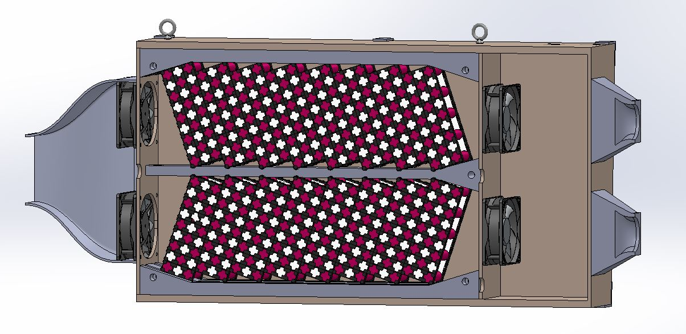

Battery compartment
===================

The battery compartment has two shelves of battery modules. Each shelf has two rows of modules for a total of four in the compartment.

There are 31 modules connected in series, with eight modules a row for three rows and seven modules in the fourth row.

.. note::
    Battery modules are removed if judges determine that the compartment is heavier than regulations allow.

    Cross-section of battery compartment

The empty cavity at the right end of the compartment houses the BPS components. 