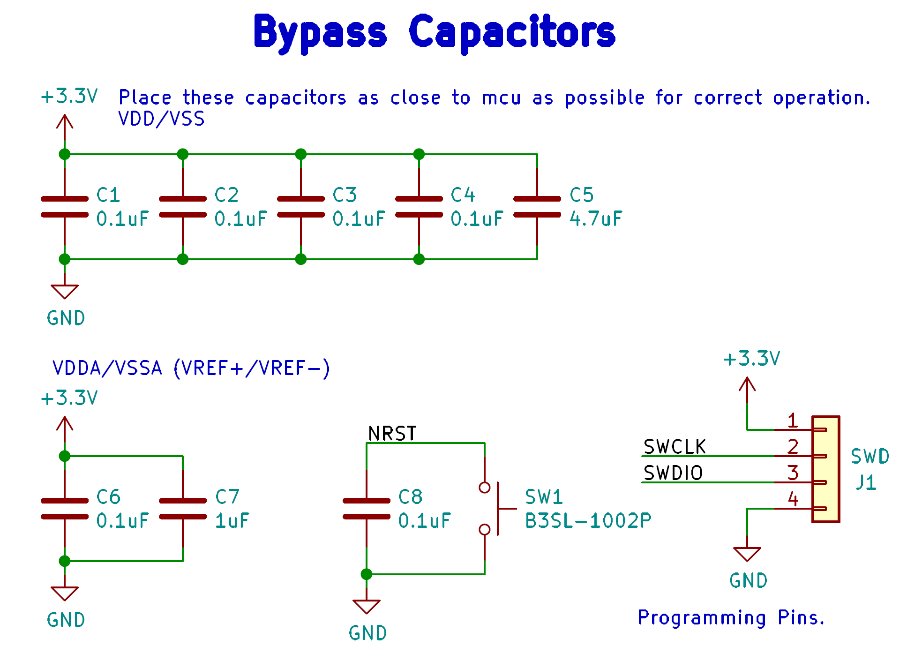

Boards and sensors
==================

There are two temperature sensors for each battery module with a module minion board for each of the four rows.
Each board measures up to 12 battery modules and 16 temperature sensors, but is configured for eight modules and 
16 sensors by default.

The Amperes minion board is connected to the main power cable that powers the electrical loop using the :term:`Hall effect sensor`. 

Leader board
------------

The Leader board uses the STM32F413 microcontroller. The board requires seven connectors:

* One 2-pin :ref:`power connector <power-connector>` (+12V, PWRGND)
* One 2-pin error light connector (+12V, PWRGND)
* One 4-pin contactor connector (+12V, PWRGND, aux1, aux2)
* One 4-pin Amperes board connector (+12V, PWRGND, IP, IM)
* One 4-pin CAN connector (isolated +5V, isolated GND, CAN high, CAN low)
* One 2-pin Minion connector (IP, IM)
* One 2x4-pin fan connector (4x +12V, 4x PWRGND)

The STM32F413 requires bypass capacitors and uses an 8MHz clock. To program the STM32F413, pins are connected to a 1x4 header to use the :abbr:`SWD (Serial Wire Debug)` programming protocol. 

The reset button allows you to avoid powering the BPS off to reset it.

.. note::
    You can configure the system to reset every time you use the Keil IDE to program it. 

For more information, see the `STM32F413 datasheet <https://www.st.com/resource/en/reference_manual/dm00305666-stm32f413-423-advanced-arm-based-32-bit-mcus-stmicroelectronics.pdf>`__.

    STM32F413 bypass capacitors 

The system's :abbr:`RTC (Real Time Clock)` is sourced from a low-power crystal oscillator. The crystal is used to set the :abbr:`PLL (Phase Lock Loop)`, which 
sets the system core frequency (CPU clock speed). The controller supports a range of frequencies, but the default is 8MHz. 

The :abbr:`MCU (Microcontroller Unit)` has an alternate internal clock that saves power consumption at the cost of precision. 
Since this system is safety critical, the external 8MHz crystal was added. 

.. note::
    The internal and external clocks were not tested against each other.

Capacitor values are set based on the crystal’s load capacitance and the capacitance of the whole board. 
The crystal and capacitor should be as physically close to the MCU as possible to avoid signal drift.

.. figure:: ../_static/crystal-capacitors.png
    :align: center

    STM32 crystal layout

.. _power-connector:

Power connector
^^^^^^^^^^^^^^^
The Leader board gets a 12V power supply. The voltage must be dropped to power the MCU and components. The total voltage required for all the components is +3.3V and +5V. 

An isolated DC-DC converter (RI3-1205S) converts the +12V input to +5V. The +12V input will be isolated from the +5V output. The Leader board
must use the correct grounds to maintain isolation. 

A switching regulator (NCP1117) converts the +5V input to +3.3V. This does not need isolation because the +5V input and corresponding grounds are already isolated from the +12V line.

.. figure:: ../_static/leader-board-power-connector.png
    :align: center

    Leader board power distribution