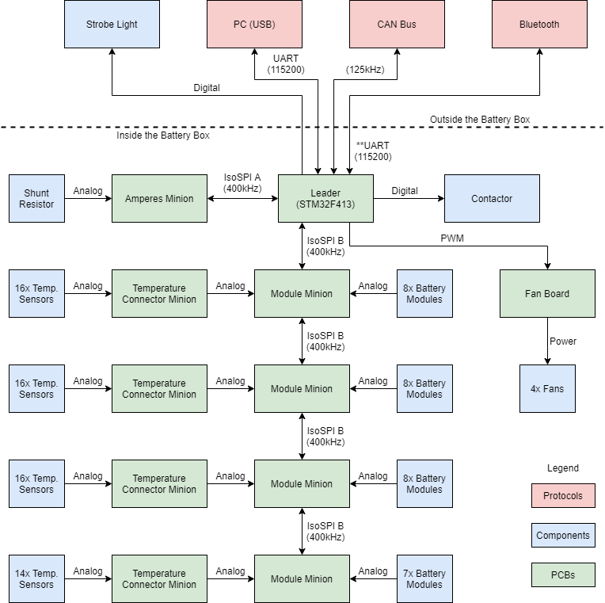

******************
Design Overview
******************

Battery pack structure
======================

BeVolt’s battery pack uses 434 Samsung INR18650-30Q li-ion cells.

There are 31 modules connected in series, with 14 cells connected in parallel in each module. 

.. note::
  Due to weight requirements, we may remove a module from the pack during the scrutineering phase. 
  
Each module will have at least two temperature sensors.

Architecture
============

BeVolt’s BPS v1.x uses a leader-minion architecture. The minion boards measure all the data and send it to the master board. 
There are two types of minion boards: Amperes and module. 

The Amperes minion board only measures the current of the whole battery pack. The module minion boards measure both the temperature and voltage of the battery modules. 

The leader board analyzes all the data and determines whether the batteries are safe. 
It also controls the contactor, which can connects the battery to the rest of the car and can disconnect it if needed, which shuts down the car.

The STM32F413 microcontroller runs the BPS software.

Communications
==============

The BPS communicates with the rest of the car through the :abbr:`CAN (Controller Area Network)` protocol, an automotive communication standard. 
It is powered by a 12V line outside the battery box. The emergency switch is connected to this line.

When the switch is pressed, the BPS powers off, which also grounds the contactor :abbr:`MOSFET (Metal Oxide Silicon Field Effect Transistor)` driver and de-energizes the contactor, 
which shuts down the car.

Board functions
===============

The minion boards will be daisy-chained to minimize wire clutter from the master board. 
The Amperes minion board uses :term:`Hall effect sensors <Hall effect sensor>` to measure the current in the high-voltage line. 

.. note::
  The minion boards all use `isolated SPI <https://www.analog.com/en/products/interface-isolation/isolation/spisolator.html>`_. 
.. 

Each minion board can evaluate up to 12 modules and 16 temperature sensors.

Two display boards are present, one on the dashboard and one for the BPS. 
The BPS Display board is separate from the dashboard to keep it independent from all other systems while debugging.

The BPS will also power the fans in the battery box.

   Overview of system
