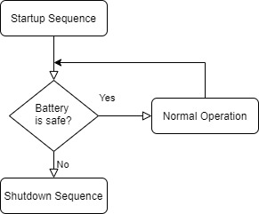
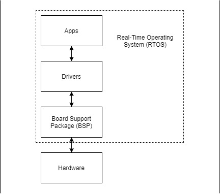

************************
Software Design Overview
************************

The software is responsible for 

- Periodically measuring the battery pack
- If the pack is unsafe, the shutdown sequence will run
- Balancing battery cells to keep the pack safe
- Periodically sending data to Telemetry

Software Flow 
=============

Software Stack 
==============

   

Board Support Package (BSP)
===========================

The BSP interfaces with peripherals and implements interrupt handlers.

Drivers
=======

Drivers interface with external hardware.
The software for the BPS has drivers for:

- :term:`CAN <CAN Bus>`
- :term:`EEPROM <EEPROM>`
- LTC6811 (Voltage and Temperature)
- AS8510 (Amperes)

Real Time Operating System (RTOS)
=================================

The :term:`RTOS <RTOS>` uses a scheduler to run multiple threads. 
Running these threads creates "pseudo-concurrency".

The RTOS ensures that safety critical tasks will not be blocked by non-safety
critical tasks.

We use the `Micrium uC/OS-III RTOS <https://docs.silabs.com/micrium/latest/micrium-general-concepts/>`__. 

Applications (Apps)
===================

The BPS Apps consist of threads/tasks and functions that interpret measurements.
The following tasks make up the BPS' engine and are shown from highest to lowest priority:

- Initialization Task
- :ref:`Fault State <Fault State Task: Manthan Upadhyaya>`
- :ref:`Critical State <Critical state Task: Manthan Upadhyaya>`
- :ref:`Pet Watchdog <Pet WatchDog Task: Harshitha Gorla & Clark Poon>`
- :ref:`Voltage/Temperature monitor <Voltage Temperature Monitor Task: Sijin Woo>`
- :ref:`Amperes monitor <Amperes Task: Manthan Upadhyaya>`
- :ref:`Battery Balancing <Battery Balancing Task: Sugam Arora>`
- :ref:`Log Information <Log Info Task>`
- :ref:`CAN Message Consumer <CAN Consumer Task: Sugam Arora>`
- :ref:`Command Line Interface (CLI) <CLI Task: Sugam Arora>`
- :ref:`Idle <Idle Task>`

Descriptions of what each task does can be found in the Tasks section.
